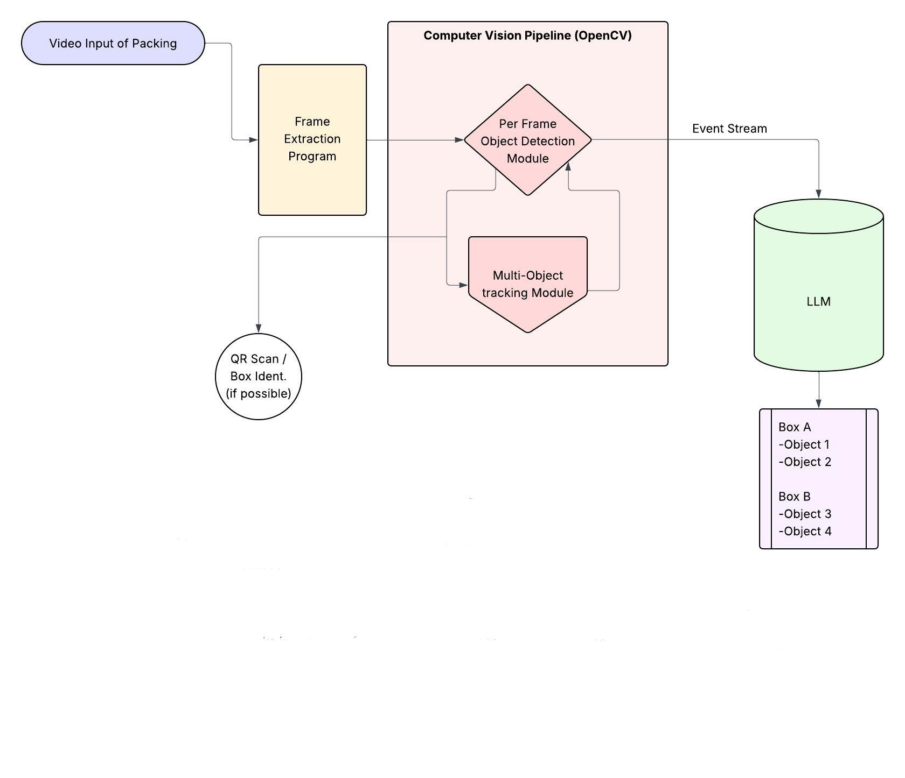

# Vision-Based Packing Project

## 📦 Project Overview
The **Vision-Based Packing Project** aims to develop an AI system that analyzes packing videos to automatically identify items and record which box they go into. Using computer vision and large language models, it streamlines inventory tracking and enhances efficiency in construction management and logistics documentation.

The project integrates **computer vision (OpenCV)** for object detection and tracking, and **large language models (LLMs)** such as **LLaMA** for contextual reasoning — combining perception and understanding to automate packing documentation in **construction management and logistics** applications.

## 🧠 System Architecture

1. **Frame Extraction Program** – splits input video into frames for analysis.
2. **Per Frame Object Detection Module (PFODM)** – detects and classifies objects in each frame.
3. **Multi-Object Tracking Module (MOTM)** – tracks object identities across frames.
4. **QR/Box Identification Module** – identifies or scans QR codes to assign items to specific boxes.
5. **LLM Reasoning Module** – processes the event stream (object + box information) and produces structured packing lists.

## ⚙️ Tech Stack
- **Python 3.10+**
- **OpenCV**        – image and video processing  
- **tqdm**          - terminal progress bar lib
- **Numpy**         - library for matrix computations
- **Ultralytics**   - YOLO computer vision modeling

